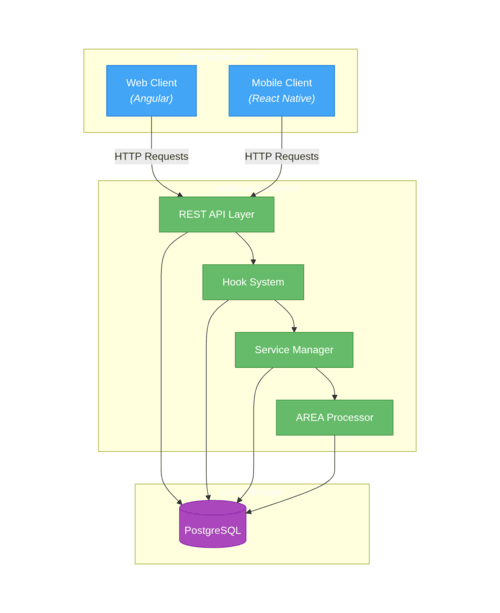

# Architecture Overview

## Components
- **Backend (server):** Node.js/Express REST API, connects to PostgreSQL.
- **Web client (web):** Angular SPA, communicates with backend via REST.
- **Mobile client (mobile):** React Native (Android), communicates with backend via REST.
- **Database:** PostgreSQL, managed via Docker Compose.

## Docker Compose
- Orchestrates all services.
- Shared volume for mobile build artifacts.

## Diagrams

## API
- The backend exposes a REST API for all business logic.
- The `/about.json` endpoint provides service metadata.

---

See `README.md` for setup instructions.
