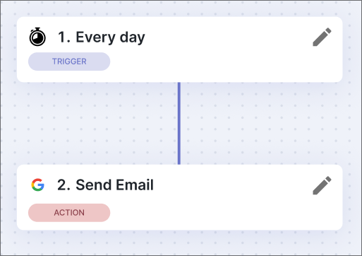

import Tabs from '@theme/Tabs';
import TabItem from '@theme/TabItem';

# Welcome to Blackpink's AREA
A brief intro to the project, what it is, and why it exists.
## Project Overview
Blackpink in your AREA is a school project under development by a team of 3rd year students at Epitech Nantes.
The core idea of the Action-REAction (AREA) project is to reproduce tools like [Zappier](https://zapier.com/) & [Make](https://www.make.com/en).

The purpose of the AREA project is to make a cross-platform app (web browser + android/ios) that can be used to automate tasks and relations between different services.

:::tip[Daily e-mail]

:::

## Quick Start
### 1. Install docker & docker-compose
<Tabs>
    <TabItem value="APT" label="Ubuntu / Debian" default>
    ```bash title="Using apt"
    # Update packages
    sudo apt update

    # Install Docker
    sudo apt install -y docker.io

    # Enable & start Docker
    sudo systemctl enable docker
    sudo systemctl start docker

    # Install Docker Compose
    sudo apt install -y docker-compose
    ```
    </TabItem>
    <TabItem value="DNF" label="Fedora / RHEL / CentOS">
    ```bash title="Using dnf or yay"
    # Install Docker
    sudo dnf install -y docker

    # Enable & start Docker
    sudo systemctl enable docker
    sudo systemctl start docker

    # Install Docker Compose
    sudo dnf install -y docker-compose
    ```
    </TabItem>
    <TabItem value="Pacman" label="Arch Linux / Manjaro">
    ```bash title="Using pacman"
    # Install Docker
    sudo pacman -Syu docker

    # Enable & start Docker
    sudo systemctl enable docker
    sudo systemctl start docker

    # Install Docker Compose
    sudo pacman -S docker-compose
    ```
    </TabItem>
    <TabItem value="Homebrew" label="macOS">
    ```bash title="Using homebrew"
    # Install Docker Desktop
    # Docker Compose comes with it
    brew install --cask docker
    ```
    </TabItem>
    <TabItem value="Chocolatey" label="Windows">
    ```powershell title="Using chocolatey"
    # Install Docker Desktop
    # Docker Compose comes with it
    choco install docker-desktop
```
    </TabItem>
</Tabs>

### 2. Clone the repository
```bash
git clone https://github.com/Five-Stacks/area.git
```

### 3. Launch the app
```bash
docker-compose up
```

This will launch a couple of things :
- Backend server & database.
- Frontend web app, accessible on http://localhost:8081.
- Frontend mobile app, see the [Mobile Setup Guide](/guides/installation/#mobile-setup) to run the app.

## Contributing

If you find a bug or want to request a feature, create an issue on the [GitHub project page](https://github.com/Five-Stacks/area/issues).

To contribute directly:
1. Create a branch from `dev`.
2. Make your changes.
3. Open a pull request.

**Important:** Read the [Contributing Guide](/getting-started/contributing) before submitting your PR.
